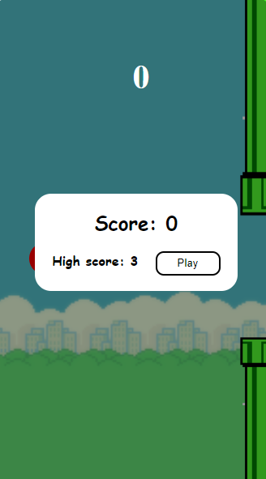
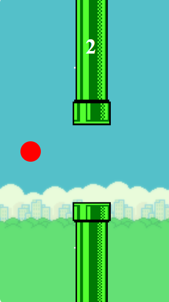
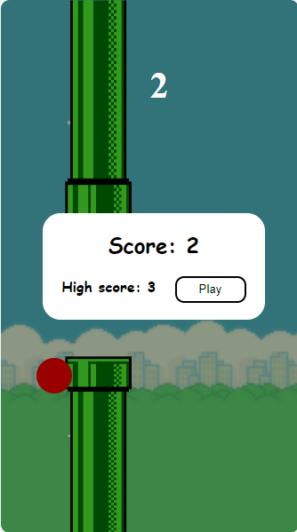

# Flappy bird copy

Simple flappy bird copy game where player controls ball that must go through obstacles.
Application is built using React.js, SASS, Typescript.

## Getting started

Prerequisite: Node Package Manager (npm) download can be found <a href="https://nodejs.org/en/download/">here</a>.

1. Clone this repository `git clone https://github.com/akrzelj-ossunist/flappy-bird`

2. `npm install` to install all required dependencies.

3. `npm start` to start the application. As you make changes the website will be automatically reloaded.

4. `localhost:3000` to see the app you have to go to this website.

## Screenshots

Home:

